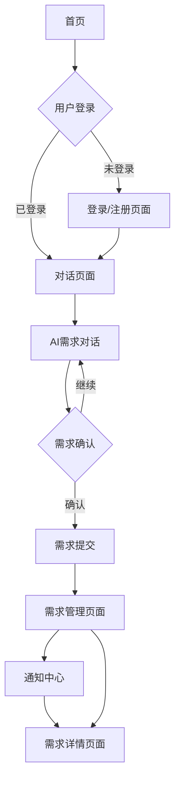

## 1. 产品概述
AI需求收集工具是一个智能对话平台，帮助用户通过自然语言交互完整描述对平台的新需求。当需求有更新或反馈时，AI会自动通知相关客户，提升需求收集效率和用户体验。

## 2. 核心功能

### 2.1 用户角色
| 角色 | 注册方式 | 核心权限 |
|------|----------|----------|
| 普通用户 | 邮箱注册 | 发起需求对话、查看需求状态、接收通知 |
| 管理员 | 后台创建 | 查看所有需求、回复需求、管理用户 |

### 2.2 功能模块
产品包含以下核心页面：
1. **首页**：需求提交入口、使用说明、快速开始
2. **对话页面**：AI对话界面、需求描述、历史记录
3. **需求管理页面**：需求列表、状态跟踪、详情查看
4. **通知中心**：消息通知、状态更新提醒
5. **用户中心**：个人信息、设置、历史需求

### 2.3 页面详情
| 页面名称 | 模块名称 | 功能描述 |
|-----------|-------------|---------------------|
| 首页 | 导航栏 | 显示logo、用户登录状态、主要导航链接 |
| 首页 | 英雄区域 | 展示产品价值主张、快速开始按钮 |
| 首页 | 功能介绍 | 介绍AI对话流程、通知机制、使用场景 |
| 对话页面 | AI对话区 | 显示对话历史、支持多轮对话、智能提示 |
| 对话页面 | 输入区域 | 文本输入框、发送按钮、语音输入（可选） |
| 对话页面 | 需求总结 | AI自动总结需求要点、生成结构化描述 |
| 需求管理 | 需求列表 | 显示用户所有需求、状态筛选、搜索功能 |
| 需求管理 | 需求详情 | 展示完整对话记录、AI总结、当前状态 |
| 通知中心 | 通知列表 | 显示系统通知、需求更新提醒、已读/未读状态 |
| 用户中心 | 个人信息 | 显示用户资料、修改密码、注销账户 |
| 用户中心 | 历史记录 | 查看历史需求、导出对话记录 |

## 3. 核心流程

### 用户需求提交流程
1. 用户访问首页，点击"开始需求对话"
2. 进入对话页面，与AI进行多轮对话描述需求
3. AI实时理解并总结需求要点，必要时询问澄清问题
4. 用户确认需求描述完整后，提交需求
5. 系统生成需求记录，分配唯一ID和初始状态
6. 需求状态变更时，系统自动通知用户

### 管理员处理流程
1. 管理员登录后台查看待处理需求列表
2. 选择需求查看详细对话记录和AI总结
3. 对需求进行评估并更新状态（已审核/需补充/已实现等）
4. 系统根据状态变化通知相关用户

## 4. 用户界面设计

### 4.1 设计风格
- **主色调**：科技蓝（#1890ff）搭配白色背景
- **辅助色**：浅灰色（#f5f5f5）用于卡片背景
- **按钮样式**：圆角矩形，主要操作为实心按钮
- **字体**：系统默认字体，标题16-18px，正文14px
- **布局风格**：卡片式布局，左右分栏设计
- **图标风格**：简约线性图标，统一视觉风格

### 4.2 页面设计概览
| 页面名称 | 模块名称 | UI元素 |
|-----------|-------------|-------------|
| 首页 | 英雄区域 | 渐变背景、大标题、副标题、CTA按钮 |
| 对话页面 | 对话区域 | 聊天气泡设计、用户消息右对齐、AI消息左对齐 |
| 对话页面 | 输入区域 | 底部固定输入框、发送按钮、语音图标 |
| 需求管理 | 需求卡片 | 状态标签、需求标题、创建时间、操作按钮 |
| 通知中心 | 通知列表 | 未读红点、时间戳、消息预览、一键已读 |

### 4.3 响应式设计
- 采用桌面端优先设计策略
- 移动端自适应，单列布局
- 触摸交互优化，按钮大小适配手指操作

## 5. 技术特性
- 集成DeepSeek API实现智能对话
- 实时消息推送机制
- 需求状态自动跟踪
- 对话历史完整保存