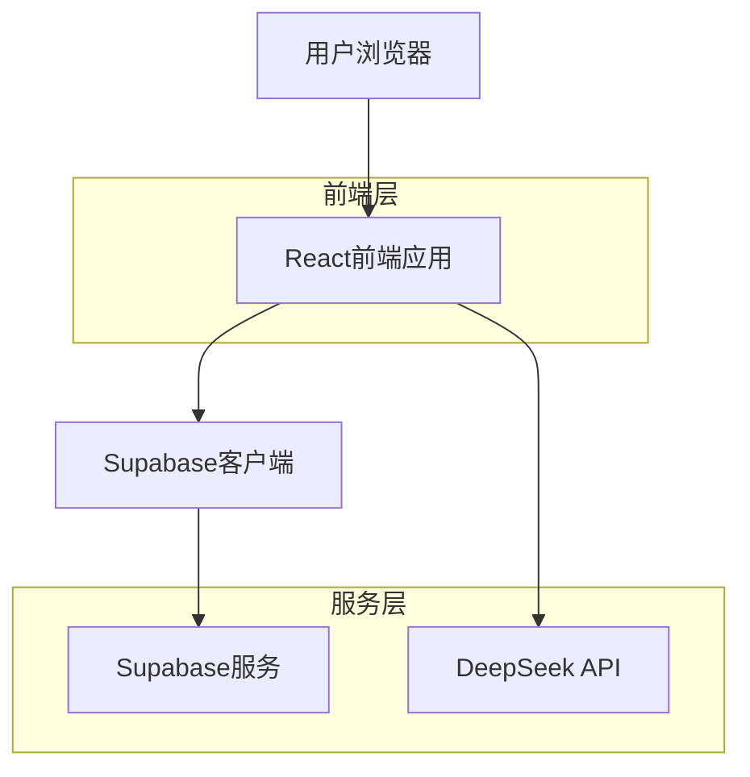
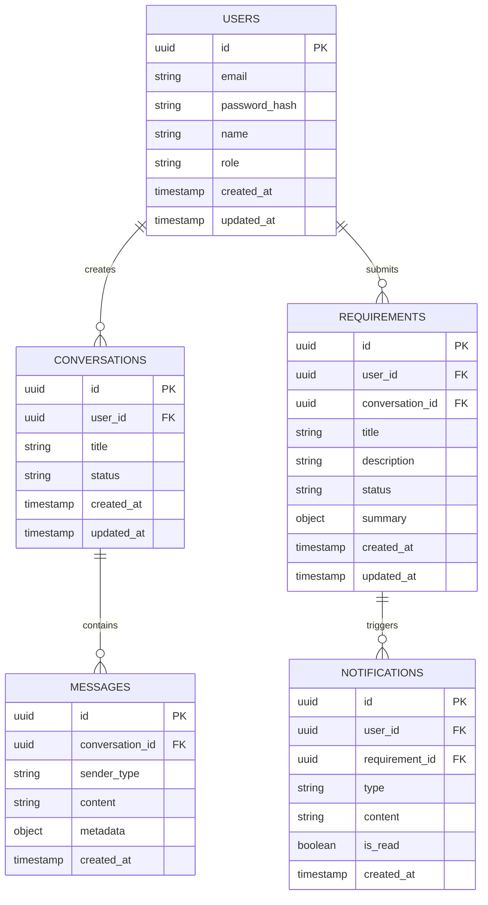

## 1. 架构设计



## 2. 技术栈描述

- **前端**: React@18 + TypeScript + TailwindCSS + Vite
- **初始化工具**: vite-init
- **后端**: Supabase (提供认证、数据库、实时订阅)
- **AI服务**: DeepSeek API
- **状态管理**: React Context + useReducer
- **UI组件**: HeadlessUI + 自定义组件

## 3. 路由定义

| 路由 | 用途 |
|-------|---------|
| / | 首页，产品介绍和快速入口 |
| /login | 登录页面，用户身份验证 |
| /register | 注册页面，新用户注册 |
| /chat | AI对话页面，需求收集核心功能 |
| /requirements | 需求管理页面，查看历史需求 |
| /requirements/:id | 需求详情页面，查看具体需求对话 |
| /notifications | 通知中心，查看系统通知 |
| /profile | 用户中心，个人信息管理 |

## 4. API定义

### 4.1 用户认证API

```
POST /api/auth/register
```

请求参数：
| 参数名 | 参数类型 | 是否必需 | 描述 |
|-----------|-------------|-------------|-------------|
| email | string | 是 | 用户邮箱地址 |
| password | string | 是 | 用户密码 |
| name | string | 是 | 用户姓名 |

响应参数：
| 参数名 | 参数类型 | 描述 |
|-----------|-------------|-------------|
| user | object | 用户信息对象 |
| session | object | 会话信息 |

### 4.2 AI对话API

```
POST /api/chat/send-message
```

请求参数：
| 参数名 | 参数类型 | 是否必需 | 描述 |
|-----------|-------------|-------------|-------------|
| message | string | 是 | 用户发送的消息 |
| conversationId | string | 否 | 对话ID（新对话可为空） |
| context | object | 否 | 上下文信息 |

响应参数：
| 参数名 | 参数类型 | 描述 |
|-----------|-------------|-------------|
| reply | string | AI回复内容 |
| conversationId | string | 对话ID |
| requirementSummary | object | 需求总结信息 |

### 4.3 需求管理API

```
GET /api/requirements
```

请求参数：
| 参数名 | 参数类型 | 是否必需 | 描述 |
|-----------|-------------|-------------|-------------|
| userId | string | 是 | 用户ID |
| status | string | 否 | 需求状态筛选 |
| page | number | 否 | 页码 |
| limit | number | 否 | 每页数量 |

## 5. 数据模型

### 5.1 数据模型定义



### 5.2 数据定义语言

用户表（users）
```sql
-- 创建用户表
CREATE TABLE users (
    id UUID PRIMARY KEY DEFAULT gen_random_uuid(),
    email VARCHAR(255) UNIQUE NOT NULL,
    password_hash VARCHAR(255) NOT NULL,
    name VARCHAR(100) NOT NULL,
    role VARCHAR(20) DEFAULT 'user' CHECK (role IN ('user', 'admin')),
    created_at TIMESTAMP WITH TIME ZONE DEFAULT NOW(),
    updated_at TIMESTAMP WITH TIME ZONE DEFAULT NOW()
);

-- 创建索引
CREATE INDEX idx_users_email ON users(email);
CREATE INDEX idx_users_role ON users(role);
```

对话表（conversations）
```sql
-- 创建对话表
CREATE TABLE conversations (
    id UUID PRIMARY KEY DEFAULT gen_random_uuid(),
    user_id UUID REFERENCES users(id) ON DELETE CASCADE,
    title VARCHAR(255),
    status VARCHAR(20) DEFAULT 'active' CHECK (status IN ('active', 'completed', 'archived')),
    created_at TIMESTAMP WITH TIME ZONE DEFAULT NOW(),
    updated_at TIMESTAMP WITH TIME ZONE DEFAULT NOW()
);

-- 创建索引
CREATE INDEX idx_conversations_user_id ON conversations(user_id);
CREATE INDEX idx_conversations_status ON conversations(status);
```

消息表（messages）
```sql
-- 创建消息表
CREATE TABLE messages (
    id UUID PRIMARY KEY DEFAULT gen_random_uuid(),
    conversation_id UUID REFERENCES conversations(id) ON DELETE CASCADE,
    sender_type VARCHAR(20) CHECK (sender_type IN ('user', 'ai')),
    content TEXT NOT NULL,
    metadata JSONB,
    created_at TIMESTAMP WITH TIME ZONE DEFAULT NOW()
);

-- 创建索引
CREATE INDEX idx_messages_conversation_id ON messages(conversation_id);
CREATE INDEX idx_messages_created_at ON messages(created_at);
```

需求表（requirements）
```sql
-- 创建需求表
CREATE TABLE requirements (
    id UUID PRIMARY KEY DEFAULT gen_random_uuid(),
    user_id UUID REFERENCES users(id) ON DELETE CASCADE,
    conversation_id UUID REFERENCES conversations(id) ON DELETE CASCADE,
    title VARCHAR(255) NOT NULL,
    description TEXT,
    status VARCHAR(20) DEFAULT 'pending' CHECK (status IN ('pending', 'reviewing', 'approved', 'rejected', 'implemented')),
    summary JSONB,
    created_at TIMESTAMP WITH TIME ZONE DEFAULT NOW(),
    updated_at TIMESTAMP WITH TIME ZONE DEFAULT NOW()
);

-- 创建索引
CREATE INDEX idx_requirements_user_id ON requirements(user_id);
CREATE INDEX idx_requirements_status ON requirements(status);
CREATE INDEX idx_requirements_created_at ON requirements(created_at DESC);
```

通知表（notifications）
```sql
-- 创建通知表
CREATE TABLE notifications (
    id UUID PRIMARY KEY DEFAULT gen_random_uuid(),
    user_id UUID REFERENCES users(id) ON DELETE CASCADE,
    requirement_id UUID REFERENCES requirements(id) ON DELETE CASCADE,
    type VARCHAR(50) NOT NULL,
    content TEXT NOT NULL,
    is_read BOOLEAN DEFAULT FALSE,
    created_at TIMESTAMP WITH TIME ZONE DEFAULT NOW()
);

-- 创建索引
CREATE INDEX idx_notifications_user_id ON notifications(user_id);
CREATE INDEX idx_notifications_requirement_id ON notifications(requirement_id);
CREATE INDEX idx_notifications_is_read ON notifications(is_read);
```

### 5.3 Supabase权限设置

```sql
-- 基本权限设置
GRANT SELECT ON users TO anon;
GRANT ALL PRIVILEGES ON users TO authenticated;

GRANT SELECT ON conversations TO anon;
GRANT ALL PRIVILEGES ON conversations TO authenticated;

GRANT SELECT ON messages TO anon;
GRANT ALL PRIVILEGES ON messages TO authenticated;

GRANT SELECT ON requirements TO anon;
GRANT ALL PRIVILEGES ON requirements TO authenticated;

GRANT SELECT ON notifications TO anon;
GRANT ALL PRIVILEGES ON notifications TO authenticated;

-- RLS策略示例
ALTER TABLE conversations ENABLE ROW LEVEL SECURITY;
CREATE POLICY "用户只能查看自己的对话" ON conversations
    FOR ALL USING (auth.uid() = user_id);

ALTER TABLE requirements ENABLE ROW LEVEL SECURITY;
CREATE POLICY "用户只能查看自己的需求" ON requirements
    FOR ALL USING (auth.uid() = user_id);
```

## 6. 集成DeepSeek API

### 6.1 API配置
```typescript
const DEEPSEEK_CONFIG = {
  apiKey: process.env.VITE_DEEPSEEK_API_KEY,
  baseURL: 'https://api.deepseek.com/v1',
  model: 'deepseek-chat',
  maxTokens: 2000,
  temperature: 0.7
};
```

### 6.2 提示词模板
```typescript
const SYSTEM_PROMPT = `你是一个专业的需求分析师，帮助用户完整描述他们的产品需求。

你的任务：
1. 通过对话引导用户完整描述需求
2. 识别需求中的关键信息（功能、用户、场景等）
3. 在对话结束时生成结构化的需求总结
4. 用中文进行对话

对话要求：
- 主动询问用户需求的背景和目的
- 澄清模糊的需求描述
- 确保需求的完整性和可行性
- 最终输出包含：功能描述、用户角色、使用场景、验收标准`;
```

## 7. 实时通知实现

使用Supabase实时订阅功能：
```typescript
const subscription = supabase
  .channel('requirements-changes')
  .on('postgres_changes', 
    { event: 'UPDATE', schema: 'public', table: 'requirements' },
    (payload) => {
      if (payload.new.user_id === currentUser.id) {
        showNotification('需求状态更新', payload.new.status);
      }
    }
  )
  .subscribe();
```